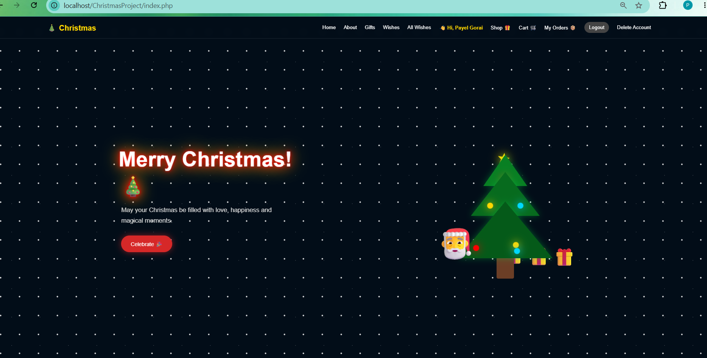
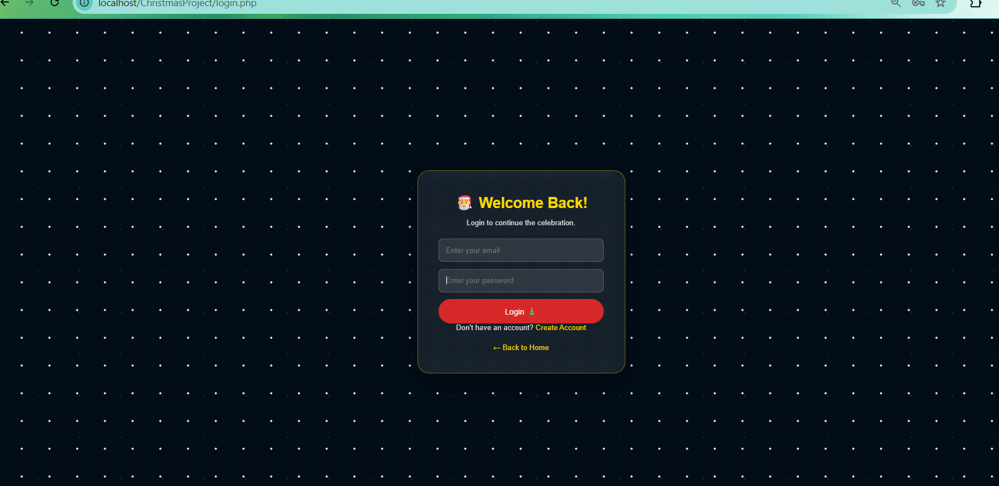
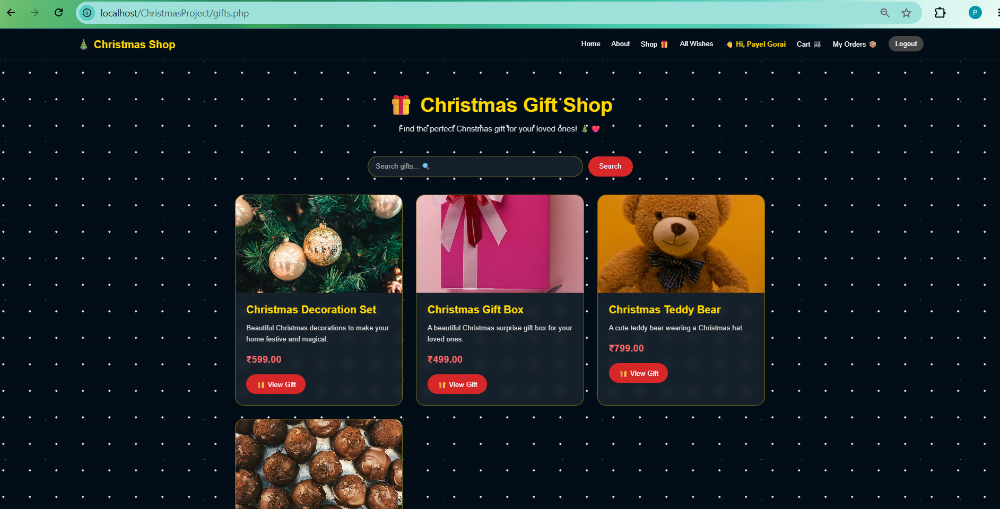
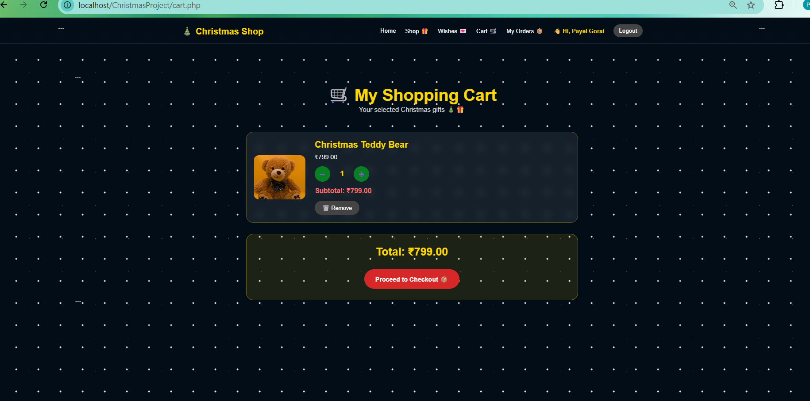
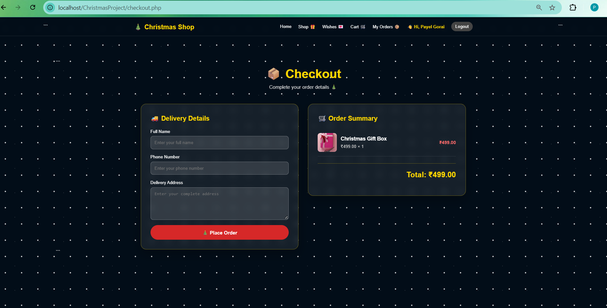
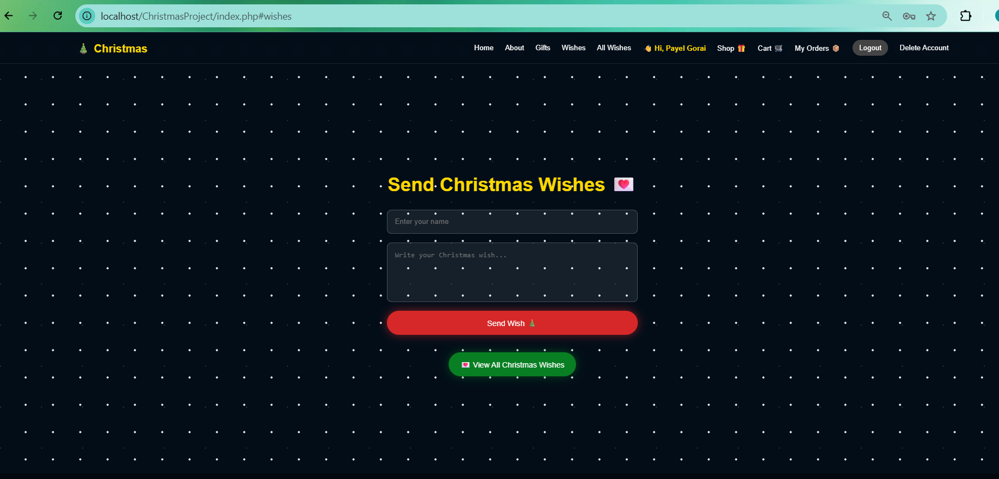
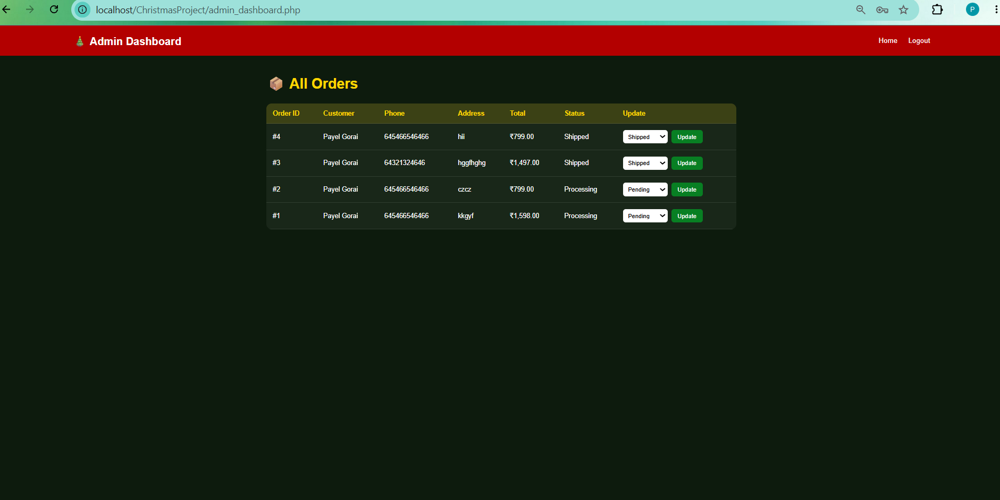

# 🎄 Christmas Gift Shop

A full-stack e-commerce web application built with **PHP** and **MySQL**, where users can browse Christmas gifts, add them to a cart, place orders, and track order status — with a secure admin panel to manage orders.


---

## ✨ Features

### 👤 For Customers

* 🔐 **Secure Authentication** — Registration and login with hashed passwords using `password_hash()` and `password_verify()`
* 🎁 **Browse Gifts** — View available Christmas gifts with images, descriptions, and prices
* 🔍 **Search Gifts** — Find gifts easily by name
* 🛒 **Shopping Cart** — Add items, increase/decrease quantity, and remove products
* 💳 **Checkout** — Enter delivery details and place an order
* 📦 **Order Tracking** — View order history and current order status
* 💌 **Christmas Wishes** — Leave and view festive greeting messages
* 🗑️ **Account Deletion** — Users can permanently delete their account

### 👨‍💼 For Admin

* 📊 **Admin Dashboard** — View all customer orders
* 🔄 **Order Status Management** — Update order status from a dropdown
* 🔐 **Protected Admin Access** — Admin routes are protected using session-based role checks

### 🛡️ Security Highlights

* All database queries use **prepared statements** to help prevent SQL injection
* Passwords are hashed and never stored in plain text
* Users can only access and manage their own cart and orders
* Order totals are recalculated on the server during checkout
* Admin pages are protected using role-based session checks

---

## 🛠️ Tech Stack

| Layer           | Technology                         |
| --------------- | ---------------------------------- |
| Backend         | PHP (Procedural PHP with `mysqli`) |
| Database        | MySQL                              |
| Frontend        | HTML5, CSS3, Vanilla JavaScript    |
| Local Server    | XAMPP (Apache + MySQL)             |
| Version Control | Git & GitHub                       |

---

## 📁 Project Structure

```text
ChristmasProject/
│
├── screenshots/
│
├── index.php
├── login.php
├── register.php
├── logout.php
├── db.php
│
├── gifts.php
├── gift_details.php
├── add_to_cart.php
├── cart.php
├── update_cart.php
├── remove_cart.php
│
├── checkout.php
├── place_order.php
├── order_success.php
├── my_orders.php
│
├── admin_dashboard.php
├── update_order_status.php
│
├── save_wish.php
├── all_wishes.php
├── delete_account.php
│
├── christmas.css
├── script.js
│
├── christmas_db.sql
└── README.md
```

---

## 🗄️ Database

**Database Name:** `christmas_db`

The project includes the complete database SQL file:

```text
christmas_db.sql
```

### Database Tables

| Table    | Purpose                                     |
| -------- | ------------------------------------------- |
| `users`  | Stores customer and admin accounts          |
| `gifts`  | Stores Christmas gift products              |
| `cart`   | Stores items added to users' carts          |
| `orders` | Stores customer orders and delivery details |
| `wishes` | Stores Christmas greeting messages          |

---

## 🚀 Installation & Setup

### 1️⃣ Clone the Repository

```bash
git clone https://github.com/Payel-Gorai-dev/ChristmasProject.git
```

Or download the project as a ZIP file.

### 2️⃣ Move the Project to XAMPP

Place the project folder inside:

```text
C:\xampp\htdocs\
```

The project path should look like:

```text
C:\xampp\htdocs\ChristmasProject
```

### 3️⃣ Start XAMPP

Open the XAMPP Control Panel and start:

* ✅ Apache
* ✅ MySQL

### 4️⃣ Create the Database

Open phpMyAdmin:

```text
http://localhost/phpmyadmin
```

Create a database named:

```text
christmas_db
```

### 5️⃣ Import the Database

1. Select the `christmas_db` database
2. Click **Import**
3. Select the file:

```text
christmas_db.sql
```

4. Click **Import**

### 6️⃣ Check Database Connection

Open:

```text
db.php
```

Update the database credentials if your local setup is different.

### 7️⃣ Run the Project

Open your browser and visit:

```text
http://localhost/ChristmasProject/index.php
```

---

## 👨‍💼 Creating an Admin Account

First, register a normal user account.

Then open phpMyAdmin → `christmas_db` → SQL and run:

```sql
UPDATE users
SET is_admin = 1
WHERE email = 'your_email@example.com';
```

Replace:

```text
your_email@example.com
```

with your registered email address.

---

## 📸 Screenshots

### 🏠 Home Page



### 🔐 Login Page



### 🎁 Gift Shop



### 🛒 Shopping Cart



### 💳 Checkout



### 💌 Christmas Wishes



### 👨‍💼 Admin Dashboard



---

## 🎯 Key Learning Concepts

This project helped demonstrate and practice:

* PHP Backend Development
* MySQL Database Integration
* CRUD Operations
* User Authentication
* Password Hashing
* Session Management
* Shopping Cart Functionality
* Order Management
* Admin Panel Development
* Prepared Statements
* Git & GitHub

---

## 🙋‍♀️ Author

**Payel Gorai**

BCA Graduate | Aspiring Web Developer

GitHub: https://github.com/Payel-Gorai-dev

---

## 📄 License

This project is created for **learning and portfolio purposes**.

Feel free to explore and learn from the project.
